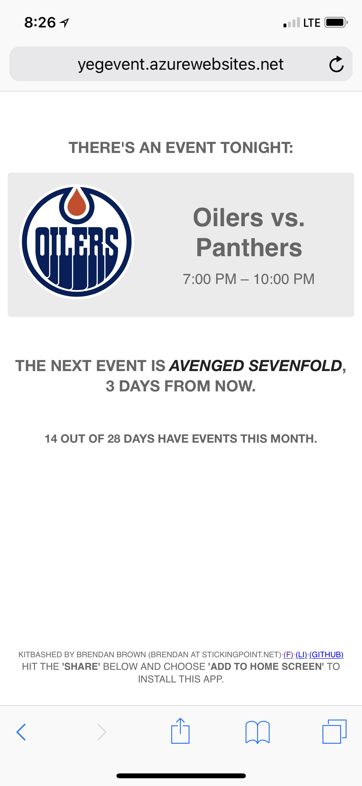

# yegevent
My learning project web app for event night status

Made in Javascript with data scraped from www.rogersplace.com/events. Currently the JSON data is refreshed nightly via a python script which scrapes the page.

### Reference Image
The mobile display should display something like this.


Shown with an oilers game day which uses lightweight, fast loading .svg vector images to display logos to prevent slow loading.

### Scrape Refresh Code
```python
#!/usr/bin/env python

#python2 version. sigh
import sys
sitepackage = "D:\home\site\wwwroot\env\Lib\site-packages"
sys.path.append(sitepackage)

import urllib2

html = urllib2.urlopen('http://www.rogersplace.com/events/').read()

import pprint
import json
import demjson
import re
import datetime
from bs4 import BeautifulSoup  # $ pip install beautifulsoup4
soup = BeautifulSoup(html, "html.parser")
script = soup.find('script', text=re.compile('var cal_events'))

eventsObj = demjson.decode(script.string[17:])
#script.string = re.sub(r'"',r'\\"',script.string)
#script.string = re.sub(r'\'',r'"',script.string)
#print(eventsObj)

print script.string

#json_text = re.search(r'^\s*window\.blog\.data\s*=\s*({.*?})\s*;\s*$',
#                      script.string, flags=re.DOTALL | re.MULTILINE).group(1)
#data = json.loads(json_text)
#assert data['activity']['type'] == 'read'

print '\n\n\n\n\n\n\n'

try:
	print eventsObj[1]['title']
except: 
	sys.exit(452)


with open('d:\home\site\wwwroot\datasource\jsonfile.js', 'w') as wf:
	wf.write('var cal_events = ')
	json.dump(eventsObj, wf)
print 'sucessful refresh'
```
